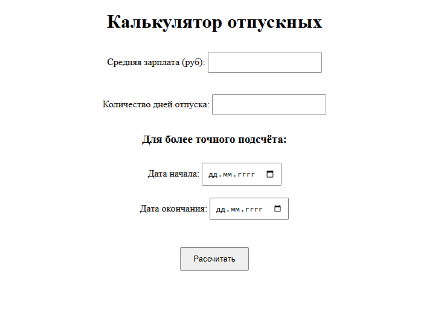
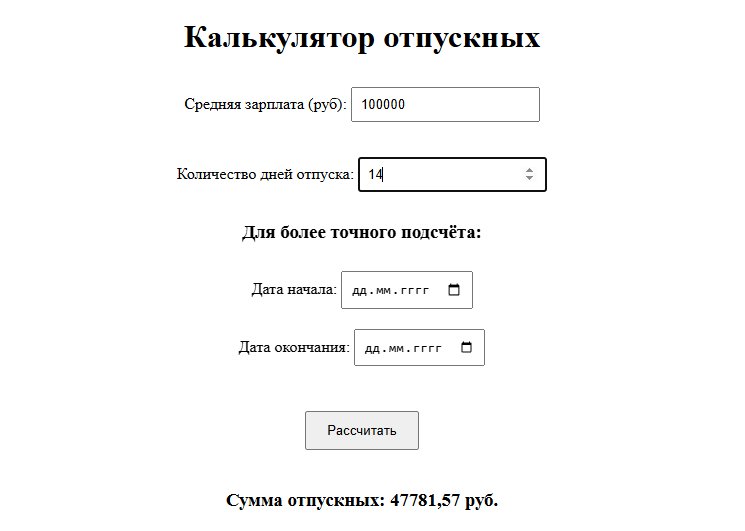
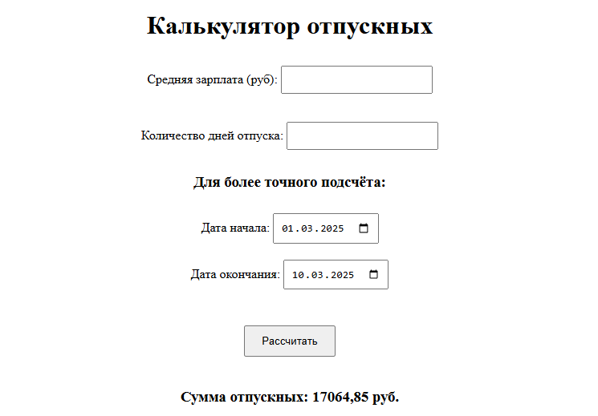
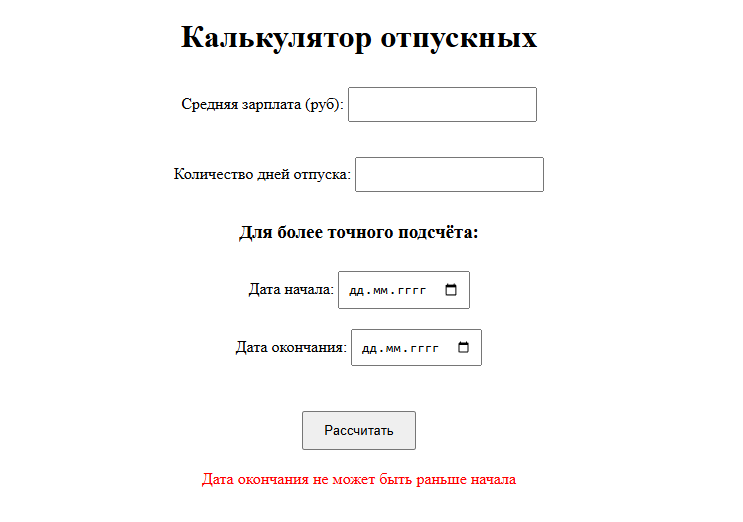

# NeoflexTestTask

- [x] Подсчёт отпускных на основе средней зарплаты и количества дней отпуска
- [x] Подсчёт отпускных с указанием точных дат начала и конца отпуска (проверка на выходной и несколько праздников)
- [x] Unit тесты 

---

**index.html**

**После простого подсчёта**

**После подсчёта с указанием точных дат**

**Вывод ошибки на экран**

